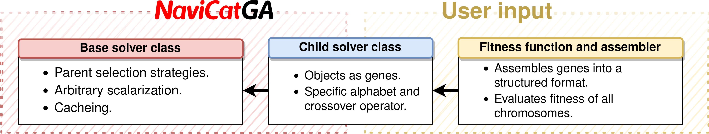

NaviCatGA: A flexible Genetic Algorithm Optimizer for the NaviCat project
=========================================================================


[](https://zenodo.org/badge/latestdoi/322634265)


## Contents
* [About](#about-)
* [Install](#install-)
* [Documentation](#documentation-)
* [Config-driven usage](#config-driven-usage-)
* [Examples](#examples-)

## About [↑](#about)

NaviCatGA is part of the [NaviCat project](https://github.com/lcmd-epfl/NaviCat) from [LCMD](https://www.epfl.ch/labs/lcmd/) at EPFL.

The NaviCat project is funded within the [NCCR Catalysis](https://www.nccr-catalysis.ch/)  of the [Swiss National Science Foundation](https://www.snf.ch/en).

The NaviCatGA code runs on pure python and is thus it is easy to adapt for particular applications.
Dependencies are minimal for the base class: 
- `numpy`
- `matplotlib`

The library is projected as base class containing the core methods, which are inherited by child classes to define the problem.



Several child solver classes are provided as fairly complete examples, but might need to be adapted or monkeypatched for particular applications.

The child classes and some functionalities have additional dependencies:

- The selfies_solver class implementation requires `selfies` (https://github.com/aspuru-guzik-group/selfies) and `rdkit` (https://www.rdkit.org/). `rdkit` may be replaced manually by openbabel python bindings or other chemoinformatic modules.
- The smiles_solver class implementation requires `rdkit` (https://www.rdkit.org/). `rdkit` may be replaced manually by openbabel python bindings or other chemoinformatic modules.
- The xyz_solver class implementation requires `AaronTools` (https://github.com/QChASM/AaronTools.py). 
- Wrappers and chemistry modules contain functions that depend on `pyscf` to solve the electronic structure problem. However, these are provided for exemplary purposes and not a core functionality.
- `matter-chimera` (https://github.com/aspuru-guzik-group/chimera) is recommended for scalarization. Alternatively, a scalarizer object with a scalarize method can be passed to the solver.

Additional features require `alive-progress` (for progress bars, very useful for CLI usage). However, these are implemented by monkeypatching the base class, and thus no functionality is lost without them.


## Install [↑](#install)

Installation is as simple as:
```python
python setup.py install --record files.txt
```

This ensures easy uninstall. Just remove all files listed in files.txt using:
```bash
rm $(cat files.txt)
```

## Documentation [↑](#documentation)

The documentation is available [here](https://navicatga.readthedocs.io/).

Built with Sphinx + [Furo](https://github.com/pradyunsg/furo) + [MyST](https://myst-parser.readthedocs.io/) + [sphinx-autoapi](https://github.com/readthedocs/sphinx-autoapi) (auto-generated API reference, no hand-maintained `.rst` module list). To build locally:

```bash
pip install -r docs/requirements.txt
sphinx-build -b html docs/ docs/_build/html
```

Then open `docs/_build/html/index.html`.

## Config-driven usage [↑](#config-driven-usage)

Every GA run needs three ingredients: a **solver** (which representation), an **assembler** (chromosome → the object being scored, e.g. `chromosome_to_smiles`) and a **fitness function** (that object → a score). Wiring these up by hand means a Python launcher script that hardcodes the solver constructor call, which is what most downstream projects end up doing.

`navicatGA.config` builds a solver from a YAML file instead, so the launcher script stays generic and only the YAML changes between experiments:

```python
from navicatGA.config import build_solver_from_yaml

solver, config = build_solver_from_yaml("my_project/config.yaml")
result = solver.solve()
```

The YAML declares the solver type and resolves `fitness_function`/`chromosome_to_*`/`scalarizer` by dotted `module.path:attr` reference (`module.path:attr()` calls a zero-arg factory first, for navicatGA's own bundled example assemblers like `concatenate_list()`):

```yaml
solver:
  type: smiles
  fitness_function: my_project.fitness:my_fitness_function
  chromosome_to_smiles: my_project.assemblers:my_smiles_builder
  # scalarizer:                     # optional, for multi-objective fitness
  #   class: chimera:Chimera
  #   kwargs:
  #     tolerances: [0.25, 0.1, 0.25]
  #     goals: [max, max, min]
  params:
    n_genes: 8
    pop_size: 50
    mutation_rate: 0.25
    # ...any other GenAlgSolver/solver-specific parameter
```

Values that are computed at runtime rather than static (e.g. an alphabet read from a database) aren't expressible in YAML. Build them in the launcher script and pass them as extra kwargs, which override/extend the YAML's `params` block:

```python
alphabet_list = my_alphabet_builder(...)
solver, config = build_solver_from_yaml("my_project/config.yaml", alphabet_list=alphabet_list)
```

`templates/{float,smiles,selfies,xyz}.yaml` are starting-point configs listing every parameter each solver accepts, with the library defaults filled in; `templates/launcher.py` is a generic runner and `templates/assembler_and_fitness.py` is a stub `assemble()`/`score()` pair to fill in. Copy all three into a new project and fill in the blanks. See `templates/README.md`, or `docs/tutorials/07_custom_solver.md` for a full worked example of writing an assembler/fitness function/launcher from scratch.

## Examples [↑](#examples)

The tests subdirectory contains a copious amount of tests which double as examples.

## Citation

If you use NaviCatGA in your research, please cite:

[](https://chemistry-europe.onlinelibrary.wiley.com/doi/abs/10.1002/cmtd.202100107)

[Genetic Optimization of Homogeneous Catalysts](https://chemistry-europe.onlinelibrary.wiley.com/doi/abs/10.1002/cmtd.202100107)

```bibtex
@article{laplaza_genetic_2022,
	title = {Genetic {Optimization} of {Homogeneous} {Catalysts}},
	url = {https://chemistry-europe.onlinelibrary.wiley.com/doi/abs/10.1002/cmtd.202100107},
	doi = {10.1002/cmtd.202100107},
	language = {en},
	journal = {Chemistry–Methods},
	volume = {2},
	pages = {e202100107},
	author = {Laplaza, Raúl and Gallarati, Simone and Corminboeuf, Clémence},
	month = mar,
	year = {2022},
}
```

---


