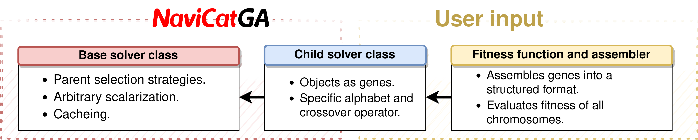

NavicatGA: A flexible Genetic Algorithm Optimizer for the NaviCat project
================================================================


The code runs on pure python and is not extremely optimized. It is easy to adapt for particular applications.

Dependencies are minimal for the base class: 
- `numpy`
- `matplotlib`

The library is projected as base class containing the core methods, which are inherited by child classes to define the problem.




Several child solver classes are provided as fairly complete examples, but might need to be adapted or monkeypatched for particular applications.

- `matter-chimera` (https://github.com/aspuru-guzik-group/chimera) is recommended for scalarization. Alternatively, a scalarizer object with a scalarize method can be passed to the solver.
- The selfies_solver class implementation requires `selfies` (https://github.com/aspuru-guzik-group/selfies) and `rdkit` (https://www.rdkit.org/). `rdkit` may be replaced manually by openbabel python bindings or other chemoinformatic modules.
- The smiles_solver class implementation requires `rdkit` (https://www.rdkit.org/). `rdkit` may be replaced manually by openbabel python bindings or other chemoinformatic modules.
- The xyz_solver class implementation requires `AaronTools` (https://github.com/QChASM/AaronTools.py). 
- Wrappers and chemistry modules contain functions that depend on `pyscf` to solve the electronic structure problem. However, these are provided for exemplary purposes and not a core functionality.

Additional features require `alive-progress` (for progress bars, very useful for CLI usage). However, these are implemented by monkeypatching the base class, and thus no functionality is lost without them.

Installation is as simple as:
```python
python setup.py install --record files.txt
```

This ensures easy uninstall. Just remove all files listed in files.txt using:
```bash
rm $(cat files.txt)
```


